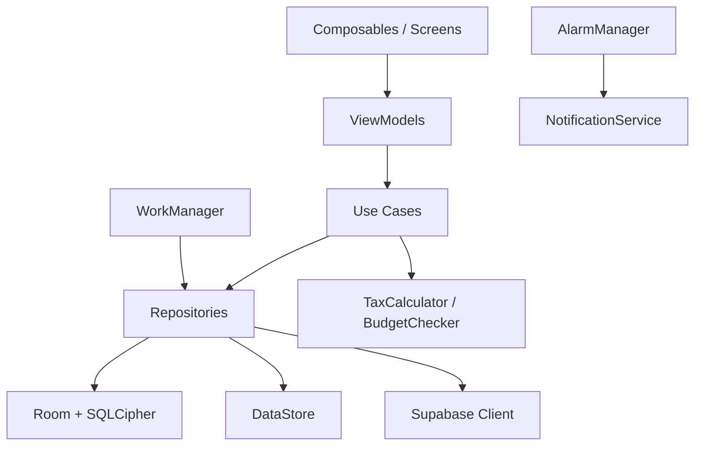

# Diseño Técnico — Ábaco Contabilidad v2

## Visión General

Esta v2 extiende la arquitectura MVVM + Repository existente con 16 nuevas funcionalidades. Se mantiene la misma base tecnológica (Compose, Room, Hilt, DataStore) y se agregan: Supabase para sincronización, ZXing para QR, iText/PdfDocument para PDF, WorkManager para tareas en segundo plano, y SQLCipher para cifrado.

---

## Arquitectura

Se mantiene **MVVM + Repository Pattern** con las capas existentes. Se agregan:

```
UI Layer        → Composables + ViewModels (nuevas pantallas)
Domain Layer    → Use Cases + Models nuevos
Data Layer      → Repositories nuevos + Room (tablas nuevas) + Supabase client
Background      → WorkManager (sync, recurrentes) + AlarmManager (vencimientos)
Security        → SQLCipher + EncryptedSharedPreferences (PIN)
```



### Nuevas dependencias

```toml
# libs.versions.toml — agregar
supabase = "3.1.4"
ktor = "3.1.3"
sqlcipher = "4.5.4"
zxing = "3.5.3"
itext = "7.2.5"
workmanager = "2.10.1"
coil = "2.7.0"
```

```kotlin
// build.gradle.kts — agregar
implementation(libs.supabase.postgrest)
implementation(libs.supabase.realtime)
implementation(libs.supabase.auth)
implementation(libs.ktor.android)
implementation(libs.sqlcipher)
implementation(libs.zxing.core)
implementation(libs.itext.core)
implementation(libs.workmanager.ktx)
implementation(libs.coil.compose)
```

---

## Componentes e Interfaces

### Nuevas pantallas

| Pantalla | ViewModel | Descripción |
|---|---|---|
| JournalEntryListScreen | JournalViewModel | Listado de asientos contables |
| JournalEntryFormScreen | JournalViewModel | Formulario de asiento en partida doble |
| BalanceSheetScreen | BalanceSheetViewModel | Balance General con fecha de corte |
| TrialBalanceScreen | TrialBalanceViewModel | Balance de Comprobación + exportar PDF |
| PaymentDueListScreen | PaymentDueViewModel | Pagos pendientes con vencimientos |
| BudgetScreen | BudgetViewModel | Presupuestos por categoría |
| ContactListScreen | ContactViewModel | Catálogo de clientes y proveedores |
| ContactFormScreen | ContactViewModel | Formulario de contacto |
| ReportsScreen | ReportsViewModel | Flujo de caja, proyección, comparativa |
| SearchScreen | SearchViewModel | Búsqueda y filtros avanzados |
| QrCodeScreen | QrCodeViewModel | Generación y compartir QR de cobro |
| OnboardingScreen | — | Pantallas de bienvenida (sin VM) |
| PinScreen | PinViewModel | Ingreso y configuración de PIN |
| SettingsDrawer | SettingsViewModel | Drawer lateral derecho (tema, PIN, moneda) |

### Navegación actualizada

```
BottomNavBar
  ├── Dashboard      (ruta: "dashboard")
  ├── Transacciones  (ruta: "transactions")
  ├── Gráficos       (ruta: "charts")          ← NUEVO
  ├── Tributos       (ruta: "taxes")
  └── Asientos       (ruta: "journal")         ← NUEVO

TopAppBar
  └── Botón menú → SettingsDrawer (lateral derecho)

Rutas adicionales:
  "balance_sheet", "trial_balance", "payment_dues",
  "budgets", "contacts", "reports", "search",
  "qr_code", "onboarding", "pin_setup"
```

---

## Modelos de Datos

### Partida doble

```kotlin
@Entity(tableName = "journal_entries")
data class JournalEntryEntity(
    @PrimaryKey(autoGenerate = true) val id: Long = 0,
    val date: LocalDate,
    val description: String,
    val updatedAt: Long = System.currentTimeMillis(),
    val syncStatus: SyncStatus = SyncStatus.PENDING
)

@Entity(tableName = "journal_lines",
    foreignKeys = [ForeignKey(entity = JournalEntryEntity::class,
        parentColumns = ["id"], childColumns = ["entryId"],
        onDelete = ForeignKey.CASCADE)])
data class JournalLineEntity(
    @PrimaryKey(autoGenerate = true) val id: Long = 0,
    val entryId: Long,
    val accountName: String,
    val accountType: AccountType,   // ASSET, LIABILITY, EQUITY, INCOME, EXPENSE
    val debit: Double = 0.0,
    val credit: Double = 0.0
)

enum class AccountType { ASSET, LIABILITY, EQUITY, INCOME, EXPENSE }
```

### Pagos pendientes

```kotlin
@Entity(tableName = "payment_dues")
data class PaymentDueEntity(
    @PrimaryKey(autoGenerate = true) val id: Long = 0,
    val description: String,
    val amount: Double,
    val currency: Currency = Currency.CUP,
    val dueDate: LocalDate,
    val isPaid: Boolean = false,
    val alarmId1: Int? = null,   // 1 día antes
    val alarmId2: Int? = null,   // día del vencimiento
    val updatedAt: Long = System.currentTimeMillis()
)
```

### Presupuestos

```kotlin
@Entity(tableName = "budgets")
data class BudgetEntity(
    @PrimaryKey(autoGenerate = true) val id: Long = 0,
    val category: String,
    val limitAmount: Double,
    val month: Int,
    val year: Int
)
```

### Contactos

```kotlin
@Entity(tableName = "contacts")
data class ContactEntity(
    @PrimaryKey(autoGenerate = true) val id: Long = 0,
    val name: String,
    val phone: String,
    val type: ContactType,   // CLIENT, SUPPLIER
    val notes: String = "",
    val updatedAt: Long = System.currentTimeMillis()
)

enum class ContactType { CLIENT, SUPPLIER }
```

### Transacciones (extensión del modelo existente)

```kotlin
// Agregar campos al TransactionEntity existente:
val currency: String = "CUP"          // CUP, MLC, USD
val amountCup: Double = amount        // importe convertido a CUP
val contactId: Long? = null           // FK opcional a contacts
val receiptImagePath: String? = null  // ruta local de la foto
val isRecurring: Boolean = false
val recurringId: Long? = null         // FK a recurring_templates
val updatedAt: Long = System.currentTimeMillis()
val syncStatus: String = "PENDING"
```

### Transacciones recurrentes

```kotlin
@Entity(tableName = "recurring_templates")
data class RecurringTemplateEntity(
    @PrimaryKey(autoGenerate = true) val id: Long = 0,
    val type: TransactionType,
    val amount: Double,
    val currency: String,
    val category: String,
    val description: String,
    val frequency: RecurringFrequency,  // DAILY, WEEKLY, BIWEEKLY, MONTHLY
    val startDate: LocalDate,
    val nextDate: LocalDate,
    val isActive: Boolean = true
)

enum class RecurringFrequency { DAILY, WEEKLY, BIWEEKLY, MONTHLY }
```

### Multimoneda

```kotlin
@Serializable
data class CurrencyConfig(
    val mlcToCup: Double = 1.0,
    val usdToCup: Double = 1.0
)

enum class Currency { CUP, MLC, USD }
```

### Sincronización

```kotlin
enum class SyncStatus { PENDING, SYNCED, CONFLICT, FAILED }
```

### QR de cobro

```kotlin
@Serializable
data class PaymentQrData(
    val accountNumber: String,
    val phone: String,
    val holderName: String
)
```

---

## Propiedades de Corrección

*Una propiedad es una característica o comportamiento que debe mantenerse verdadero en todas las ejecuciones válidas del sistema — esencialmente, una declaración formal sobre lo que el sistema debe hacer. Las propiedades sirven como puente entre las especificaciones legibles por humanos y las garantías de corrección verificables por máquina.*

### Propiedad 1: Cuadre de asientos contables
*Para cualquier* asiento contable, la validación debe aceptarlo si y solo si la suma de todos sus débitos es igual a la suma de todos sus créditos.
**Valida: Requisito 9.1**

### Propiedad 2: Round-trip de serialización de asientos
*Para cualquier* asiento contable válido con sus líneas, serializarlo a JSON y deserializarlo debe producir un objeto equivalente al original.
**Valida: Requisito 9.5**

### Propiedad 3: Ecuación contable del Balance General
*Para cualquier* conjunto de asientos contables válidos, el Balance General calculado debe satisfacer Activos = Pasivos + Patrimonio.
**Valida: Requisito 10.2**

### Propiedad 4: Filtro por fecha de corte del Balance
*Para cualquier* fecha de corte y conjunto de asientos, el Balance General debe incluir exactamente los asientos con fecha ≤ fecha de corte y excluir los posteriores.
**Valida: Requisito 10.3**

### Propiedad 5: Resolución de conflictos por timestamp
*Para cualquier* par de registros (local, remoto) con `updatedAt` distintos, la estrategia de resolución debe seleccionar el registro con mayor `updatedAt`.
**Valida: Requisito 12.4**

### Propiedad 6: Límite de reintentos de sincronización
*Para cualquier* secuencia de fallos de red, el número de reintentos no debe superar 3, y cada intervalo de espera debe ser mayor o igual al anterior.
**Valida: Requisito 12.6**

### Propiedad 7: Alerta de presupuesto al 80%
*Para cualquier* categoría con presupuesto definido, si el total de gastos del período dividido entre el límite es mayor o igual a 0.8, el estado de alerta debe ser activo.
**Valida: Requisito 15.2**

### Propiedad 8: Filtros combinados con lógica AND
*Para cualquier* combinación de filtros (fecha, categoría, importe) aplicados a una lista de transacciones, el resultado debe ser igual a la intersección de aplicar cada filtro individualmente.
**Valida: Requisito 19.5**

### Propiedad 9: Cálculo de próxima ocurrencia de recurrentes
*Para cualquier* plantilla recurrente con frecuencia y fecha de inicio, la fecha de próxima ocurrencia calculada debe ser exactamente una unidad de frecuencia posterior a la fecha actual de la plantilla.
**Valida: Requisito 20.2**

### Propiedad 10: Conversión multimoneda a CUP
*Para cualquier* lista de transacciones en distintas monedas y un tipo de cambio dado, el total en CUP debe ser igual a la suma de cada importe multiplicado por su tasa de conversión correspondiente.
**Valida: Requisito 23.3**

### Propiedad 11: Round-trip de datos del QR
*Para cualquier* objeto `PaymentQrData`, el texto codificado en el QR debe contener exactamente el número de cuenta, teléfono y nombre del titular originales.
**Valida: Requisito 24.2**

---

## Manejo de Errores

| Situación | Comportamiento |
|---|---|
| Asiento no cuadrado | Error inline mostrando la diferencia (débitos - créditos) |
| Fallo de sincronización Supabase | Reintentar con backoff, marcar como FAILED tras 3 intentos |
| Conflicto de sincronización irresoluble | Notificar al usuario con opción de elegir versión |
| Imagen de recibo demasiado grande | Comprimir automáticamente antes de guardar |
| PIN incorrecto 5 veces | Bloquear 30 segundos, mostrar contador regresivo |
| Permiso de cámara denegado | Ofrecer solo galería, mostrar mensaje explicativo |
| Permiso de notificaciones denegado | Mostrar diálogo explicativo, deshabilitar AlarmManager |
| Error de generación de PDF | Mostrar Snackbar con mensaje, log interno |

---

## Estrategia de Testing

### Testing unitario

- Probar `JournalEntryValidator` con asientos cuadrados y no cuadrados.
- Probar `BalanceSheetCalculator` con conjuntos de asientos conocidos.
- Probar `ConflictResolver` con pares de registros con distintos `updatedAt`.
- Probar `CurrencyConverter` con tasas y monedas conocidas.
- Probar `RecurringScheduler` con todas las frecuencias.
- Probar `BudgetChecker` con porcentajes en los límites (79%, 80%, 100%).

### Testing basado en propiedades (Property-Based Testing)

Se usará **Kotest** con `kotest-property` (ya configurado). Cada propiedad se ejecutará con mínimo **100 iteraciones**.

Formato de anotación obligatorio:
`// Feature: abaco-contabilidad-v2, Property {N}: {texto de la propiedad}`

Las propiedades 1–11 definidas arriba se implementarán como property tests con generadores `Arb` de Kotest.

### Generadores de datos (Arb) a implementar

```kotlin
// Generadores necesarios para los property tests
Arb.journalEntry()          // asientos con líneas aleatorias
Arb.balancedJournalEntry()  // asientos que cuadran
Arb.unbalancedJournalEntry()// asientos que no cuadran
Arb.syncRecord()            // registros con updatedAt aleatorio
Arb.budget()                // presupuestos con límites aleatorios
Arb.transactionList()       // listas de transacciones con monedas mixtas
Arb.paymentQrData()         // datos de QR con strings válidos
```
