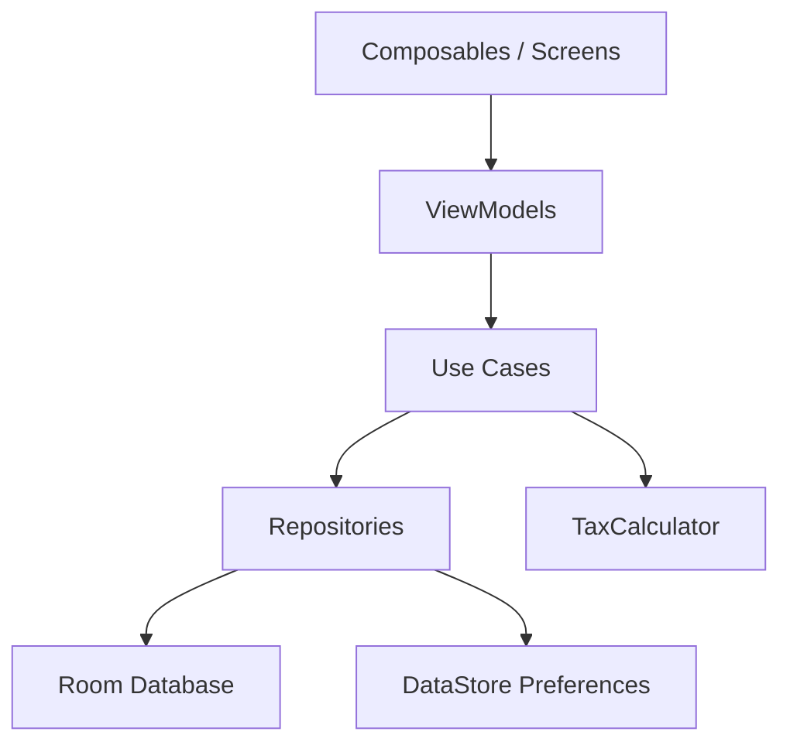

# Diseño Técnico — Ábaco Contabilidad

## Visión General

Ábaco es una app Android nativa construida con Jetpack Compose + Material 3. Sigue una arquitectura MVVM limpia con repositorios, y usa Room para persistencia local. La navegación se implementa con Compose Navigation con animaciones deslizantes tipo iOS. La app es modular: cada módulo puede activarse o desactivarse en tiempo de ejecución sin pérdida de datos.

---

## Arquitectura

Se adopta **MVVM + Repository Pattern** con las siguientes capas:

```
UI Layer        → Composables + ViewModels
Domain Layer    → Use Cases + Models de dominio
Data Layer      → Repositories + Room DAO + DataStore
```



### Decisiones de diseño

- **Room** para transacciones (datos estructurados con queries complejas).
- **DataStore** para configuración tributaria y estado de módulos (pares clave-valor simples).
- **Compose Navigation** con `AnimatedNavHost` para transiciones deslizantes.
- **Hilt** para inyección de dependencias.
- **Kotlinx Serialization** para serialización JSON (round-trip de transacciones y configuración).

---

## Componentes e Interfaces

### Navegación

```
BottomNavBar
  ├── Dashboard (ruta: "dashboard")
  ├── Transacciones (ruta: "transactions")
  └── Tributos (ruta: "taxes") [visible solo si módulo activo]

TopAppBar
  └── Configuración (ruta: "settings")
```

Transiciones: `slideInHorizontally` / `slideOutHorizontally` según dirección de navegación, con `spring` de baja amortiguación para sensación iOS.

### Pantallas

| Pantalla | ViewModel | Descripción |
|---|---|---|
| DashboardScreen | DashboardViewModel | Gráficos + resumen mensual |
| TransactionListScreen | TransactionViewModel | Listado + FAB para nueva transacción |
| TransactionFormScreen | TransactionViewModel | Formulario ingreso/gasto |
| TaxScreen | TaxViewModel | Cálculo y desglose ONAT |
| SettingsScreen | SettingsViewModel | Módulos + configuración tributaria |

### Interfaces clave

```kotlin
interface TransactionRepository {
    fun getTransactionsByPeriod(year: Int, month: Int): Flow<List<Transaction>>
    suspend fun insert(transaction: Transaction)
    suspend fun update(transaction: Transaction)
    suspend fun delete(transaction: Transaction)
}

interface TaxConfigRepository {
    fun getTaxConfig(): Flow<TaxConfig>
    suspend fun saveTaxConfig(config: TaxConfig)
}

interface ModuleRepository {
    fun getModuleStates(): Flow<Map<AppModule, Boolean>>
    suspend fun setModuleEnabled(module: AppModule, enabled: Boolean)
}
```

---

## Modelos de Datos

```kotlin
// Transacción
@Entity(tableName = "transactions")
data class Transaction(
    @PrimaryKey(autoGenerate = true) val id: Long = 0,
    val type: TransactionType,       // INCOME | EXPENSE
    val amount: Double,
    val category: String,
    val description: String,
    val date: LocalDate,
    val year: Int,
    val month: Int
)

enum class TransactionType { INCOME, EXPENSE }

// Configuración tributaria
@Serializable
data class TaxConfig(
    val cssRate: Double = 0.20,           // 20% por defecto
    val iipBrackets: List<TaxBracket> = defaultBrackets()
)

@Serializable
data class TaxBracket(
    val from: Double,
    val to: Double?,                      // null = sin límite superior
    val rate: Double
)

// Resultado de cálculo tributario
data class TaxResult(
    val grossIncome: Double,
    val netIncome: Double,
    val cssAmount: Double,
    val iipAmount: Double,
    val iipBracketDetails: List<BracketDetail>
)

data class BracketDetail(
    val bracket: TaxBracket,
    val taxableAmount: Double,
    val taxAmount: Double
)

// Módulos
enum class AppModule {
    TAX_ONAT,
    DASHBOARD_CHARTS,
    TAX_SETTINGS
}
```

### Categorías (enumeradas)

```kotlin
enum class IncomeCategory(val label: String) {
    SALES("Ventas"),
    SERVICES("Servicios"),
    RENTAL("Arrendamiento"),
    OTHER("Otros")
}

enum class ExpenseCategory(val label: String) {
    RAW_MATERIALS("Materias primas"),
    TRANSPORT("Transporte"),
    UTILITIES("Servicios públicos"),
    OTHER("Otros")
}
```

---

## Propiedades de Corrección

*Una propiedad es una característica o comportamiento que debe mantenerse verdadero en todas las ejecuciones válidas del sistema — esencialmente, una declaración formal sobre lo que el sistema debe hacer. Las propiedades sirven como puente entre las especificaciones legibles por humanos y las garantías de corrección verificables por máquina.*

### Propiedad 1: Round-trip de serialización de transacciones
*Para cualquier* objeto `Transaction` válido, serializarlo a JSON y luego deserializarlo debe producir un objeto equivalente al original.
**Valida: Requisito 7.4**

### Propiedad 2: Round-trip de configuración tributaria
*Para cualquier* objeto `TaxConfig` válido, serializarlo a JSON y luego deserializarlo debe producir un objeto equivalente al original.
**Valida: Requisito 6.5, 4.6**

### Propiedad 3: CSS siempre no negativa
*Para cualquier* valor de ingresos brutos mayor o igual a cero y cualquier tasa CSS entre 0% y 100%, el importe calculado de CSS debe ser mayor o igual a cero.
**Valida: Requisito 4.1, 4.5**

### Propiedad 4: IIP con ingresos cero produce tributo cero
*Para cualquier* configuración de tramos IIP válida, cuando la utilidad neta es cero, el IIP calculado debe ser exactamente cero.
**Valida: Requisito 4.5**

### Propiedad 5: Escala progresiva del IIP es monótonamente creciente
*Para cualquier* par de utilidades netas donde A > B ≥ 0, el IIP calculado para A debe ser mayor o igual al IIP calculado para B, usando la misma configuración de tramos.
**Valida: Requisito 4.3**

### Propiedad 6: Adición de transacción incrementa el total del período
*Para cualquier* lista de transacciones de un período y cualquier transacción de ingreso válida (importe > 0), agregar esa transacción debe incrementar el total de ingresos del período en exactamente el importe de la transacción.
**Valida: Requisito 2.3, 2.4**

### Propiedad 7: Rechazo de transacciones con importe inválido
*Para cualquier* transacción con importe ≤ 0 o importe nulo, el sistema debe rechazar la operación y el estado del listado debe permanecer sin cambios.
**Valida: Requisito 2.2**

### Propiedad 8: Módulo desactivado oculta sus rutas
*Para cualquier* módulo desactivado, la lista de destinos de navegación visibles no debe contener ninguna ruta asociada a ese módulo.
**Valida: Requisito 8.2**

### Propiedad 9: Reactivación de módulo restaura datos
*Para cualquier* módulo que fue desactivado y luego reactivado, los datos asociados a ese módulo deben ser idénticos a los que existían antes de la desactivación.
**Valida: Requisito 8.3**

---

## Manejo de Errores

| Situación | Comportamiento |
|---|---|
| Importe vacío o ≤ 0 | Mostrar error inline en el campo, bloquear guardado |
| Tasa CSS fuera de [0,1] | Mostrar error inline, bloquear guardado |
| Tramos IIP no consecutivos | Mostrar error de validación, bloquear guardado |
| Error de lectura Room | Mostrar Snackbar con mensaje genérico, log interno |
| Deserialización JSON fallida | Usar valores por defecto, notificar al usuario |

---

## Estrategia de Testing

### Testing unitario

- Probar `TaxCalculator` con valores conocidos (tramos exactos, límites de tramo, cero).
- Probar validadores de formulario con entradas límite.
- Probar lógica de filtrado de módulos activos.

### Testing basado en propiedades (Property-Based Testing)

Se usará la librería **[Kotest](https://kotest.io/)** con su módulo `kotest-property` para Kotlin/Android. Cada propiedad se ejecutará con un mínimo de **100 iteraciones**.

Cada test de propiedad debe estar anotado con el siguiente formato exacto:
`// Feature: abaco-contabilidad, Property {N}: {texto de la propiedad}`

Las propiedades 1–9 definidas arriba se implementarán como property tests con generadores de datos aleatorios (Arb) de Kotest.

### Dependencias de testing a agregar

```toml
# libs.versions.toml
kotest = "5.9.1"

kotest-runner = { group = "io.kotest", name = "kotest-runner-junit5", version.ref = "kotest" }
kotest-property = { group = "io.kotest", name = "kotest-property", version.ref = "kotest" }
kotest-assertions = { group = "io.kotest", name = "kotest-assertions-core", version.ref = "kotest" }
```
